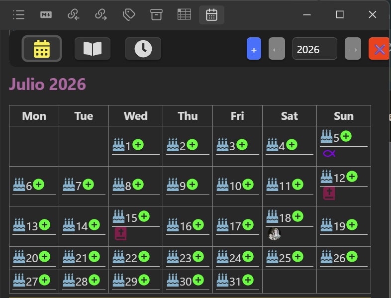
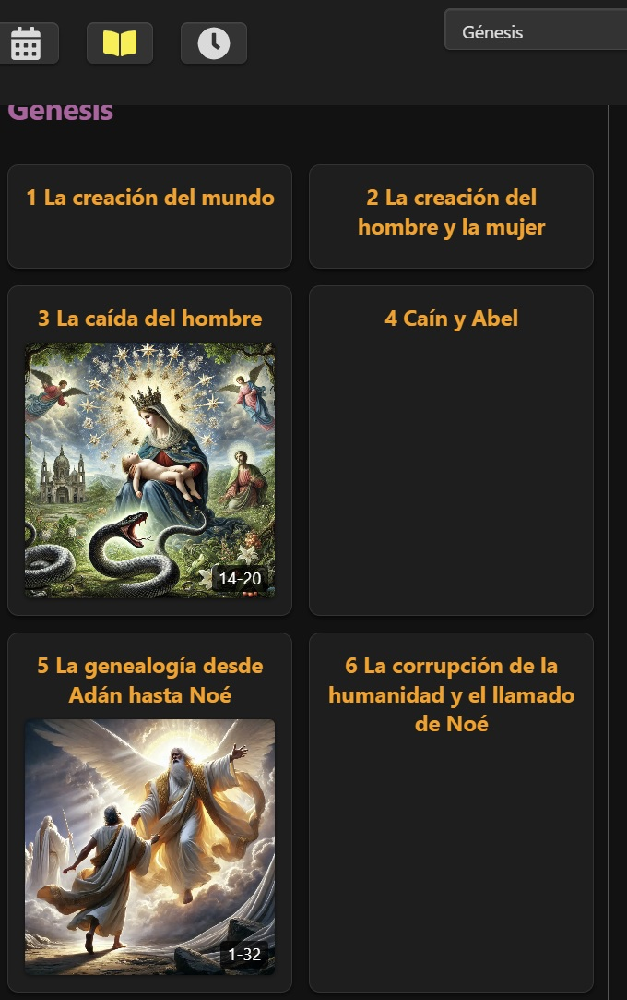
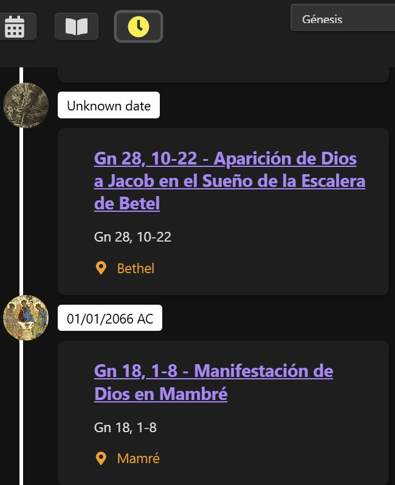

# Obsigen

[](https://github.com/jesuserro/obsigen/actions/workflows/ci.yml)
[](https://obsidian.md/)
[](https://www.typescriptlang.org/)

Obsigen is a personal Obsidian plugin for navigating dated notes through a calendar, browsing Bible notes, and displaying historical notes on a timeline.

## What it does

### Calendar

The calendar displays a full year as monthly grids. It associates daily notes and event notes with dates, opens matching vault notes, and provides an event form from each day.

### Bible

The Bible view provides book and chapter navigation. It hydrates the structure with matching vault notes and cover metadata, then opens the corresponding note when an entry is selected.

### Timeline

The timeline displays historical Bible notes with cover metadata and links back to their vault notes. Entries use this frontmatter contract:

```yaml
historical_date: "-2066-01-01"
```

Unsigned years represent AD dates. A leading minus sign represents BC dates.

### Additional note utilities

The plugin menu also exposes focused utilities for daily and yearly notes, anniversaries, favorites, and event creation.

## Screenshots

### Calendar — July 2026

Month view with daily notes, anniversaries and event markers.

<p>
  <a href="docs/images/calendar-july-2026.jpg">
    
  </a>
</p>

### Bible — Genesis

Chapter grid with illustrated entries and note navigation.

<p>
  <a href="docs/images/bible-genesis.jpg">
    
  </a>
</p>

### Timeline — historical notes

Historical timeline view with chronological labels and note cards.

<p>
  <a href="docs/images/timeline-mambre.jpg">
    
  </a>
</p>

## Status

Obsigen is primarily a personal Obsidian plugin and an experimental project. The repository is kept buildable and usable, but several data and folder conventions are tailored to the author's vault.

Obsigen is not currently listed in the Obsidian Community Plugins directory. Install it manually using the steps below.

## Requirements

- Obsidian 1.7.2 or newer
- Node.js 22 and npm to build from source

## Manual installation

First, build the plugin from source:

```bash
git clone https://github.com/jesuserro/obsigen.git
cd obsigen
npm ci
npm run build
```

The build creates `main.js` and `styles.css` in the repository root. `manifest.json` is already present there.

To install the result:

1. Create `<vault>/.obsidian/plugins/obsigen/`.
2. Copy `main.js`, `manifest.json`, and `styles.css` into that directory.
3. Restart Obsidian or reload the app.
4. Enable Obsigen under **Settings → Community plugins**.

## Development

Install the locked dependencies before running the development commands:

```bash
npm ci
```

- `npm test` runs the Jest test suite.
- `npm run typecheck` checks the TypeScript project without emitting files.
- `npm run build` creates a minified production bundle and compressed CSS.
- `npm run dev` watches the TypeScript and Sass sources for changes.

Private icon assets are optional. A clean public checkout generates an empty icon map automatically, while local PNG files remain ignored by Git.

## Optional local deployment

The standard build does not require `.env` or a vault path. To copy a completed build into a local plugin directory, set `OUTPUT_DIR` in `.env` or in the process environment:

```dotenv
OUTPUT_DIR=/path/to/vault/.obsidian/plugins/obsigen
```

Then run:

```bash
npm run build
npm run deploy:local
```

The deployment command copies only `main.js`, `manifest.json`, and `styles.css`.

## Links

- [Obsidian plugin developer documentation](https://docs.obsidian.md/Plugins/Getting+started/Build+a+plugin)
- [Issue tracker](https://github.com/jesuserro/obsigen/issues)

## Funding

If Obsigen is useful to you, you can [support its development](https://www.buymeacoffee.com/jesuserro).
